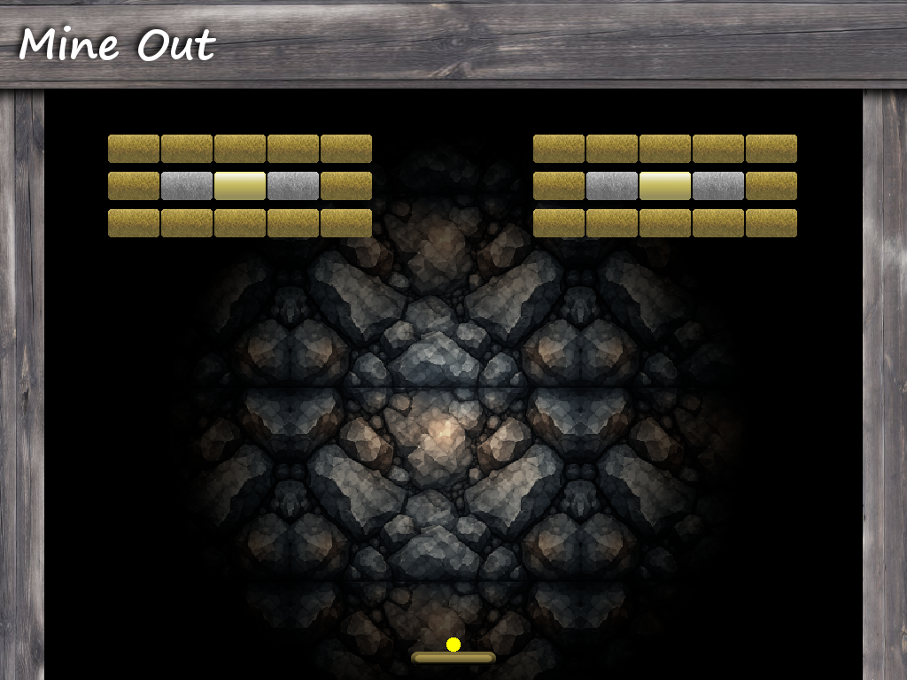

# Mine-Out Game (SFML C++)

  

This is an open-source C++ game built using SFML 3.0.x. The project uses the C++17 standard and supports multiple platforms, including macOS on ARM architecture (Apple Silicon) as well as Windows builds for both x86 and x64 architectures. SFML is linked dynamically and relies on system-installed libraries.

The project was originally created more than 15 years ago as a personal learning exercise in game development. Over the years, the source code has been maintained, modernized, and upgraded to remain compatible with SFML version 3 while continuing to serve as an open-source example of a C++ game project.

---

## Dependencies

Before building, you need to install the following dependencies via Homebrew ([https://brew.sh/](https://brew.sh/)):

* SFML (Simple and Fast Multimedia Library)
* Freetype (Font rendering library)
* libvorbis (Audio codec library)

---

## Installing Dependencies on macOS (Apple Silicon)

1. Install Homebrew (if you haven’t already) by running this command in your terminal:
   `/bin/bash -c "$(curl -fsSL [https://raw.githubusercontent.com/Homebrew/install/HEAD/install.sh](https://raw.githubusercontent.com/Homebrew/install/HEAD/install.sh))"`

2. Install SFML and dependencies by running:
   `brew install sfml freetype libvorbis`

---

## Build Instructions (Using CMake)

1. Clone or download the project.

2. Open Terminal and cd into the project directory.

3. Create a new build directory:

   `mkdir build`

4. Run CMake to configure the project:

   `cmake -S . -B build`

5. Build the game:

   `cmake --build build`

6. Run the game:

   `./build/game`

### macOS: Intel, Apple Silicon, or Universal Binary

- For Apple Silicon Macs:
  `cmake -S . -B build -DCMAKE_OSX_ARCHITECTURES=arm64`

- For older Intel Macs:
  `cmake -S . -B build -DCMAKE_OSX_ARCHITECTURES=x86_64`

- For a universal macOS binary (Intel + Apple Silicon), make sure SFML and its dependencies are also installed as universal libraries, then build with:
  `cmake -S . -B build-universal -DCMAKE_OSX_ARCHITECTURES='x86_64;arm64' -DCMAKE_OSX_DEPLOYMENT_TARGET=10.15`

  `cmake --build build-universal`

---

## Notes

* The executable dynamically links to SFML and its dependencies installed via Homebrew.
* There is no need to bundle dylib files manually or sign the executable.
* If you encounter library loading errors, ensure your Homebrew environment variables are set correctly. For example:

For Apple Silicon Macs, run:
export PATH="/opt/homebrew/bin:$PATH"

For Intel Macs, run:
export PATH="/usr/local/bin:$PATH"

* You can clean build files by running:
  `make clean`
